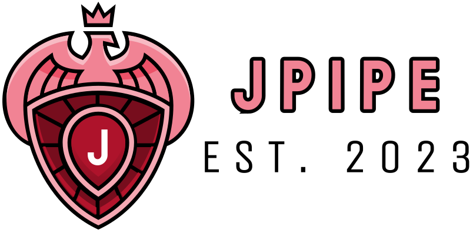

# jPipe - Justified Pipelines

<div align="center">
  
  &nbsp;&nbsp;&nbsp;&nbsp;
  
</div>

<br>

The jPipe environment supports the definition of justification to support software maintenance activities. The name comes from "justified pipelines", as the key idea is to design an environment supporting the justification of CI/CD pipelines by design.

## General Information

- Principal Investigator:
  - [Sébastien Mosser](https://mosser.github.io/), McSCert, McMaster University.
- Active Contributors:
  - [Kalvin Thuan-Phong Khuu](https://kalvinkhuu.github.io/), McSCert, McMaster University. PhD Student.
- Contributors:
  - [Nirmal Chaudhari](https://www.linkedin.com/in/nirmal2003/), McSCert, McMaster University. Undergraduate Research Assistant.
  - [Aaron Loh](https://www.linkedin.com/in/aaron-loh26/), McSCert, McMaster University. Undergraduate Research Assistant.
  - [Deesha Patel](https://www.linkedin.com/in/deeshupatel/), McSCert, McMaster University. Master Student.
  - [Corinne Pulgar](https://www.linkedin.com/in/corinne-pulgar-12a58190/), École de Technologie Supérieure (ETS). Master Student.

### Repository organization

- `jpipe-lang`: ANTLR4 grammar and generated lexer/parser
- `jpipe-model`: domain model (justification elements, symbol table)
- `jpipe-operators`: composition operator extension point and built-in operators
- `jpipe-compiler`: compiler pipeline (parsing, model building, validation, export)
- `jpipe-cli`: command-line interface and fat JAR entry point
- `docs`: technical documentation and architecture decision records
- `homebrew`: launcher script template for the Homebrew formula
- `debian`: Debian source packaging metadata for the Ubuntu PPA

### Developer Setup

#### Required tools

| Tool | Version | Purpose |
|---|---|---|
| [JDK](https://adoptium.net/) | 25 | Compilation and runtime |
| [Maven](https://maven.apache.org/) | 3.x | Build tool |
| [adr-tools](https://github.com/npryce/adr-tools) | latest | Browsing and creating architecture decision records |

#### Optional tools

| Tool | Version | Purpose |
|---|---|---|
| [MkDocs Material](https://squidfunk.github.io/mkdocs-material/) | latest | Previewing the documentation site locally (`mkdocs serve`) |

#### Building

```bash
mvn package
```

The fat JAR is produced in `jpipe-cli/target/`.

#### Releasing a new version

Releases are triggered by pushing a `v*.*.*` tag to `main`. The pipeline
creates a GitHub Release, updates the Homebrew formula, and uploads a Debian
source package to the Ubuntu PPA.

**Prerequisites:** The following secrets must be configured in the GitHub
repository settings:

| Secret | Purpose |
|--------|---------|
| `HOMEBREW_TAP_TOKEN` | PAT with write access to `jpipe-mcscert/homebrew-mcscert` |
| `GPG_PRIVATE_KEY` | ASCII-armored GPG key registered on Launchpad |
| `GPG_KEY_ID` | Fingerprint of the signing key |
| `GPG_PASSPHRASE` | Passphrase for the signing key |

**Steps:**

```bash
# 1. Verify the base version in pom.xml matches what you plan to tag.
#    pom.xml should be X.Y.Z-SNAPSHOT; the pipeline strips -SNAPSHOT automatically.
mvn verify   # confirm the build is green locally

# 2. Tag and push — the pipeline fires automatically.
git tag vX.Y.Z          # or vX.Y.Z-rcN for a pre-release
git push origin main --tags

# 3. After the pipeline completes, bump to the next development version.
mvn -B versions:set -DnewVersion=X.Y+1.0-SNAPSHOT -DgenerateBackupPoms=false
git commit -am "chore: bump to X.Y+1.0-SNAPSHOT"
git push origin main
```

**What happens automatically:**

1. The pipeline validates that the tag version matches the base version in `pom.xml`
   (e.g. tag `v2.1.0` is accepted when `pom.xml` declares `2.1.0-SNAPSHOT`).
2. `mvn versions:set` is run inside the pipeline to stamp the exact release version
   into the fat JAR manifest (`Implementation-Version: X.Y.Z`).
3. A GitHub Release is created with the fat JAR and a Homebrew tarball.
   Tags containing `-` (e.g. `-rc1`) are automatically marked as pre-releases.
4. `jpipe.rb` in the Homebrew tap is updated with the new URL and SHA256
   (stable releases only — skipped for pre-releases).
5. A signed Debian source package is uploaded to `ppa:mcscert/ppa`
   (stable releases only — skipped for pre-releases).

**Verifying the release** (~30 min after the pipeline completes):

```bash
# macOS
brew tap jpipe-mcscert/mcscert
brew install jpipe

# Ubuntu
sudo add-apt-repository ppa:mcscert/ppa
sudo apt update && sudo apt install jpipe
```

#### Code style

Formatting is enforced by Spotless (Google Java Format) and Checkstyle. To auto-format before committing:

```bash
mvn spotless:apply
```

#### Build output / shade warnings

The fat JAR build (`jpipe-cli`) merges many dependencies and would normally emit overlap warnings from the Maven Shade plugin. These are suppressed by default via `.mvn/jvm.config`. To re-enable them for a single run:

```bash
mvn package -Dorg.slf4j.simpleLogger.log.org.apache.maven.plugins.shade.DefaultShader=warn
```

## Usage

### Running the compiler

After building, the fat JAR is at `jpipe-cli/target/jpipe-cli-*.jar`. The
`process` subcommand is the default, so these two invocations are equivalent:

```bash
java -jar jpipe-cli/target/jpipe-cli-*.jar -i my.jd -d MyModel -f dot
java -jar jpipe-cli/target/jpipe-cli-*.jar process -i my.jd -d MyModel -f dot
```

### Common flags

| Flag | Short | Description |
|------|-------|-------------|
| `--input FILE` | `-i` | Input `.jd` source file (default: stdin) |
| `--output FILE` | `-o` | Output file (default: stdout) |
| `--diagram NAME` | `-d` | Name of the model to export (required) |
| `--format FORMAT` | `-f` | Output format — see table below (default: `JPIPE`) |
| `--headless` | | Suppress the logo banner |
| `--log-level LEVEL` | | Log verbosity: `OFF` `ERROR` `WARN` `INFO` `DEBUG` `TRACE` |

### Output formats

| Format | Description | Requires Graphviz |
|--------|-------------|:-----------------:|
| `JPIPE` | Canonical jPipe source (round-trip) | No |
| `DOT` | Graphviz DOT source | No |
| `PNG` | Rendered PNG image | Yes |
| `JPEG` | Rendered JPEG image | Yes |
| `SVG` | Rendered SVG image | Yes |
| `JSON` | JSON model dump | No |
| `PYTHON` | Python object model | No |

Install [Graphviz](https://graphviz.org/) and run `jpipe doctor` to verify that
the `dot` binary is on your `PATH` before using image formats.

### Other subcommands

```bash
# Parse and validate without exporting — prints diagnostics, statistics, and the symbol table
java -jar jpipe-cli/target/jpipe-cli-*.jar diagnostic -i my.jd

# Check runtime dependencies (Graphviz)
java -jar jpipe-cli/target/jpipe-cli-*.jar doctor
```

### Minimal `.jd` example

```
justification MyModel {
    conclusion  c  is "Our claim"
    strategy    s  is "Argument"
    evidence    e1 is "Evidence A"
    evidence    e2 is "Evidence B"

    s  supports c
    e1 supports s
    e2 supports s
}
```

Compile it to a DOT diagram:

```bash
java -jar jpipe-cli/target/jpipe-cli-*.jar -i my.jd -d MyModel -f dot -o my.dot
dot -Tpng my.dot -o my.png
```

More examples are in the [`examples/`](examples/) directory.

## How to cite?

```bibtex
@software{mcscert:jpipe,
  author = {Mosser, Sébastien and Khuu, Kalvin Thuan-Phong and Chaudhari, Nirmal and Loh, Aaron and Patel, Deesha and Pulgar, Corinne},
  license = {MIT},
  title = {{jPipe}},
  url = {https://github.com/jpipe-mcscert/jpipe-compiler}
}
```

## How to contribute?

Found a bug, or want to add a cool feature? Feel free to fork this repository and send a pull request.

If you're interested in contributing to the research effort related to jPipe, feel free to contact the PI: [Dr. Sébastien Mosser](mailto:mossers@mcmaster.ca).

**We do have undergrad summer internships available to contribute to the compiler, as
well as MASc and PhD positions in Software Engineering at Mac.**

### AI assistance policy

Parts of this codebase were developed with the assistance of [Claude](https://claude.ai) (Anthropic), an AI coding assistant. We are transparent about this use and welcome AI-assisted contributions, subject to the following conditions:

- Pull requests must not be 100% AI-generated. Every contribution must reflect the understanding and judgement of a human author.
- Human authors are fully responsible for the correctness, quality, and appropriateness of their contributions, regardless of whether AI tools were used in their preparation.
- Reviewers may ask contributors to explain any part of their submission.

## Sponsors

We acknowledge the support of the _Natural Sciences and Engineering Research Council of Canada_
(NSERC), as well as McMaster _Excellence in Research Award_ (EREA) from the Faculty of Engineering.

<div align="center">
  
</div>
