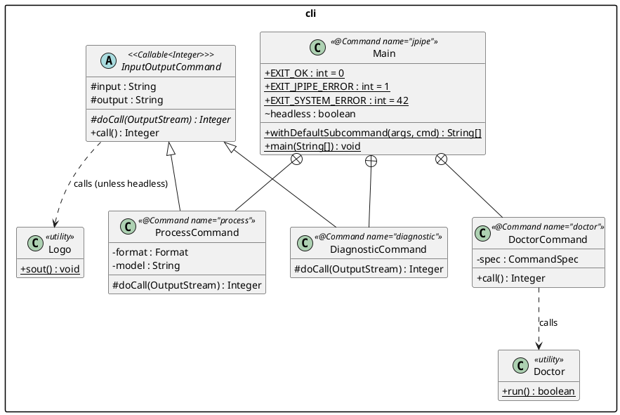

# CLI

The `jpipe-cli` module is the public entry point for jPipe. It exposes a
PicoCLI command hierarchy and assembles pipelines via `CompilerFactory`.

## Command hierarchy



## Commands

### `process` (default)

Compiles a `.jd` source file and exports the selected model in the requested
format. This is the default subcommand: invoking `jpipe` without a subcommand
name is equivalent to `jpipe process`.

```
jpipe process -i <file> -m <model> [-f <format>] [-o <output>]
```

| Option | Short | Required | Default | Description |
|--------|-------|:--------:|---------|-------------|
| `--input` | `-i` | No | stdin | Input `.jd` source file |
| `--output` | `-o` | No | stdout | Output file |
| `--model` | `-m` | **Yes** | — | Name of the model to export |
| `--format` | `-f` | No | `JPIPE` | Output format (see table below) |

Delegates to `CompilerFactory.build(config, out)`. Returns exit code `0` on
success, `1` if any ERROR or FATAL diagnostic was reported.

**Output formats**

| Value | Description | Requires Graphviz |
|-------|-------------|:-----------------:|
| `JPIPE` | Canonical jPipe source (round-trip) | No |
| `DOT` | Graphviz DOT source | No |
| `PNG` | Rendered PNG image | Yes |
| `JPEG` | Rendered JPEG image | Yes |
| `SVG` | Rendered SVG image | Yes |
| `JSON` | JSON model dump | No |
| `PYTHON` | Python object model | No |

### `diagnostic`

Parses and validates a `.jd` source file and prints a human-readable report
without exporting any model. Useful for checking a file for errors or
inspecting the symbol table.

```
jpipe diagnostic -i <file> [-o <output>]
```

The report produced by `DiagnosticReport` has four sections:

1. **Diagnostics** — all ERROR and FATAL messages, with source locations.
2. **Action Statistics** — total command count, macro count, and deferral
   count from the `ExecutionEngine`.
3. **Model Summary** — for each model: kind (justification/template), parent
   template (if any), element counts, and which justifications implement it.
4. **Symbol Table** — all element ids with their source locations, plus alias
   mappings from composition operators.

Delegates to `CompilerFactory.buildDiagnosticCompiler(out)`.

### `doctor`

Checks that external tools required by jPipe are available on `PATH` and
prints a status line for each. Also prints the jPipe version number.

```
jpipe doctor
```

Currently checks: `dot` (Graphviz). A tool is considered available if the OS
can launch the executable; the exit code of the probe is ignored. Returns exit
code `0` if all tools are found, `1` otherwise.

## Shared infrastructure

### `InputOutputCommand`

Abstract base for `ProcessCommand` and `DiagnosticCommand`. Handles:

- **Logo display** — calls `Logo.sout()` unless `--headless` is set.
- **Output stream resolution** — opens a `FileOutputStream` when `--output` is
  a file path; falls back to `System.out` for stdout.
- **Error reporting** — catches `CompilationException` and
  `UnsupportedOperationException` and prints a clean `error: …` message to
  stderr; any other exception produces `unexpected error: …` and returns exit
  code `42`.

Subclasses implement `doCall(OutputStream)` and receive the resolved output
stream.

### `Doctor`

Package-private utility that probes each required external tool by attempting
`ProcessBuilder` launch. Tools are configured in a static `LinkedHashMap` so
that new dependencies can be added without changing `DoctorCommand`.

### Default subcommand

PicoCLI 4.x has no built-in default-subcommand API. `Main.withDefaultSubcommand()`
pre-processes the argument array: if no subcommand name (and no short-circuit
flag like `--help` or `--version`) is found, it inserts `"process"` at the
correct position — after any parent-level flags with their arguments. Subcommand
names and parent flag arities are derived from the live `CommandLine` object at
call time, so the method stays correct when the command tree changes.

## Exit codes

| Code | Constant | Meaning |
|------|----------|---------|
| `0` | `EXIT_OK` | Success |
| `1` | `EXIT_JPIPE_ERROR` | Compilation error or missing tool |
| `42` | `EXIT_SYSTEM_ERROR` | Unexpected exception |
