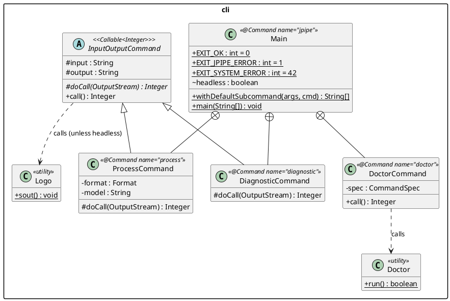

# CLI

The `jpipe-cli` module is the public entry point for jPipe. It exposes a
PicoCLI command hierarchy and assembles pipelines via `CompilerFactory`.

## Command hierarchy


```plantuml
@startuml cli

skinparam packageStyle rectangle
skinparam classAttributeIconSize 0
hide empty members

package "cli" {

  class Main <<@Command name="jpipe">> {
    + {static} EXIT_OK : int = 0
    + {static} EXIT_JPIPE_ERROR : int = 1
    + {static} EXIT_SYSTEM_ERROR : int = 42
    ~ headless : boolean
    + {static} withDefaultSubcommand(args, cmd) : String[]
    + {static} main(String[]) : void
  }

  abstract class InputOutputCommand <<Callable<Integer>>> {
    # input : String
    # output : String
    # {abstract} doCall(OutputStream) : Integer
    + call() : Integer
  }

  class ProcessCommand <<@Command name="process">> {
    - format : Format
    - model : String
    # doCall(OutputStream) : Integer
  }

  class DiagnosticCommand <<@Command name="diagnostic">> {
    # doCall(OutputStream) : Integer
  }

  class DoctorCommand <<@Command name="doctor">> {
    - spec : CommandSpec
    + call() : Integer
  }

  class Doctor <<utility>> {
    + {static} run() : boolean
  }

  class Logo <<utility>> {
    + {static} sout() : void
  }

  InputOutputCommand <|-- ProcessCommand
  InputOutputCommand <|-- DiagnosticCommand

  Main +-- ProcessCommand
  Main +-- DiagnosticCommand
  Main +-- DoctorCommand

  DoctorCommand ..> Doctor : calls
  InputOutputCommand ..> Logo : calls (unless headless)
}

@enduml
```

## Commands

### `process` (default)

Compiles a `.jd` source file and exports the selected model in the requested
format. This is the default subcommand: invoking `jpipe` without a subcommand
name is equivalent to `jpipe process`.

```
jpipe process -i <file> -m <model> [-f <format>] [-o <output>]
```

| Option | Short | Required | Default | Description |
|--------|-------|:--------:|---------|-------------|
| `--input` | `-i` | No | stdin | Input `.jd` source file |
| `--output` | `-o` | No | stdout | Output file |
| `--model` | `-m` | **Yes** | — | Name of the model to export |
| `--format` | `-f` | No | `JPIPE` | Output format (see table below) |

Delegates to `CompilerFactory.build(config, out)`. Returns exit code `0` on
success, `1` if any ERROR or FATAL diagnostic was reported.

**Output formats**

| Value | Description | Requires Graphviz |
|-------|-------------|:-----------------:|
| `JPIPE` | Canonical jPipe source (round-trip) | No |
| `DOT` | Graphviz DOT source | No |
| `PNG` | Rendered PNG image | Yes |
| `JPEG` | Rendered JPEG image | Yes |
| `SVG` | Rendered SVG image | Yes |
| `JSON` | JSON model dump | No |
| `PYTHON` | Python object model | No |

### `diagnostic`

Parses and validates a `.jd` source file and reports on it without exporting
any model. Useful for checking a file for errors, inspecting the symbol table,
or feeding an IDE.

```
jpipe diagnostic -i <file> [-o <output>] [-f <format>]
```

| Option | Values | Default |
|--------|--------|---------|
| `-f`, `--format` | `TEXT`, `JSON` (case-insensitive) | `TEXT` |

The report has five sections:

1. **Diagnostics** — all ERROR and FATAL messages, with source locations and
   their diagnostic code.
2. **Action Statistics** — total command count, macro count, and deferral
   count from the `ExecutionEngine`.
3. **Model Summary** — for each model: kind (justification/template), parent
   template (if any), element counts, and which justifications implement it.
4. **Symbol Table** — all element ids with their source locations, plus alias
   mappings from composition operators.
5. **Executed Actions** — the ordered model-construction command trace.

Sections whose data is absent (no statistics recorded, no actions executed)
are omitted rather than printed empty.

Both formats are produced from the same `DiagnosticSnapshot`, collected once by
`CollectDiagnostics` and then rendered by either `DiagnosticReport` (text) or
`JsonDiagnosticReport` (JSON), so the two can never describe different
compilations. Delegates to
`CompilerFactory.buildDiagnosticCompiler(format, out)`.

#### JSON report

```jsonc
{
  "schemaVersion": 1,
  "source": "examples/foo.jd",
  "status": "ok",                    // "ok" | "errors"
  "diagnostics": [
    { "severity": "error",           // "error" | "fatal"
      "code": "unknown-model",       // omitted when the diagnostic has no code
      "source": "foo.jd",
      "line": 12, "column": 4,       // both omitted when the location is unknown
      "message": "unknown model 'bar'" }
  ],
  "stats": { "commands": { "total": 42, "macros": 3 }, "deferrals": 1 },
  "models": [
    { "name": "m", "kind": "justification",
      "implements": "t",             // omitted when the model implements nothing
      "location": { "source": "foo.jd", "line": 3, "column": 0 },
      "elements": { "conclusion": 1, "subConclusion": 2, "strategy": 1,
                    "evidence": 3, "abstractSupport": 0 },
      "usedBy":  [ { "name": "j", "location": { … } } ],  // templates only
      "symbols": [ { "id": "e1", "kind": "evidence",
                     "synthesized": false, "location": { … } } ],
      "aliases": [ { "from": "a", "to": "b" } ] }
  ],
  "actions": [ { "index": 1, "depth": 0, "macro": false, "description": "…" } ]
}
```

Optional keys are omitted rather than emitted as `null`. Arrays preserve order;
object key order is not significant. `schemaVersion` is incremented whenever the
set of members changes, additions included — the schema is strict, so no change
is invisible to a consumer validating against it.

The document is described by a published **[JSON Schema](diagnostic-schema.md)**
that acts as the contract with consumers; it ships on the classpath at
`/schema/diagnostic-report-v1.schema.json` and every report the test suite
produces is validated against it.

The ASCII logo is suppressed automatically when the JSON report goes to
standard output, so `jpipe diagnostic -f json | jq .` works without
`--headless`. Writing to a file with `-o` keeps the banner on stdout.

**Limitation.** A *fatal* error (a syntax error, an unresolvable `load`) aborts
the pipeline before any report is produced, in either format: nothing is
written to the output stream, the message goes to standard error, and the exit
code is 1. Tools must handle that case separately.

### `doctor`

Checks that external tools required by jPipe are available on `PATH` and
prints a status line for each. Also prints the jPipe version number.

```
jpipe doctor
```

Currently checks: `dot` (Graphviz). A tool is considered available if the OS
can launch the executable; the exit code of the probe is ignored. Returns exit
code `0` if all tools are found, `1` otherwise.

## Shared infrastructure

### `InputOutputCommand`

Abstract base for `ProcessCommand` and `DiagnosticCommand`. Handles:

- **Logo display** — calls `Logo.sout()` unless `--headless` is set.
- **Output stream resolution** — opens a `FileOutputStream` when `--output` is
  a file path; falls back to `System.out` for stdout.
- **Error reporting** — catches `CompilationException` and
  `UnsupportedOperationException` and prints a clean `error: …` message to
  stderr; any other exception produces `unexpected error: …` and returns exit
  code `42`.

Subclasses implement `doCall(OutputStream)` and receive the resolved output
stream.

### `Doctor`

Package-private utility that probes each required external tool by attempting
`ProcessBuilder` launch. Tools are configured in a static `LinkedHashMap` so
that new dependencies can be added without changing `DoctorCommand`.

### Default subcommand

PicoCLI 4.x has no built-in default-subcommand API. `Main.withDefaultSubcommand()`
pre-processes the argument array: if no subcommand name (and no short-circuit
flag like `--help` or `--version`) is found, it inserts `"process"` at the
correct position — after any parent-level flags with their arguments. Subcommand
names and parent flag arities are derived from the live `CommandLine` object at
call time, so the method stays correct when the command tree changes.

## Exit codes

| Code | Constant | Meaning |
|------|----------|---------|
| `0` | `EXIT_OK` | Success |
| `1` | `EXIT_JPIPE_ERROR` | Compilation error or missing tool |
| `42` | `EXIT_SYSTEM_ERROR` | Unexpected exception |
