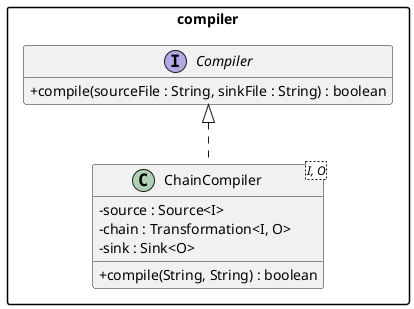
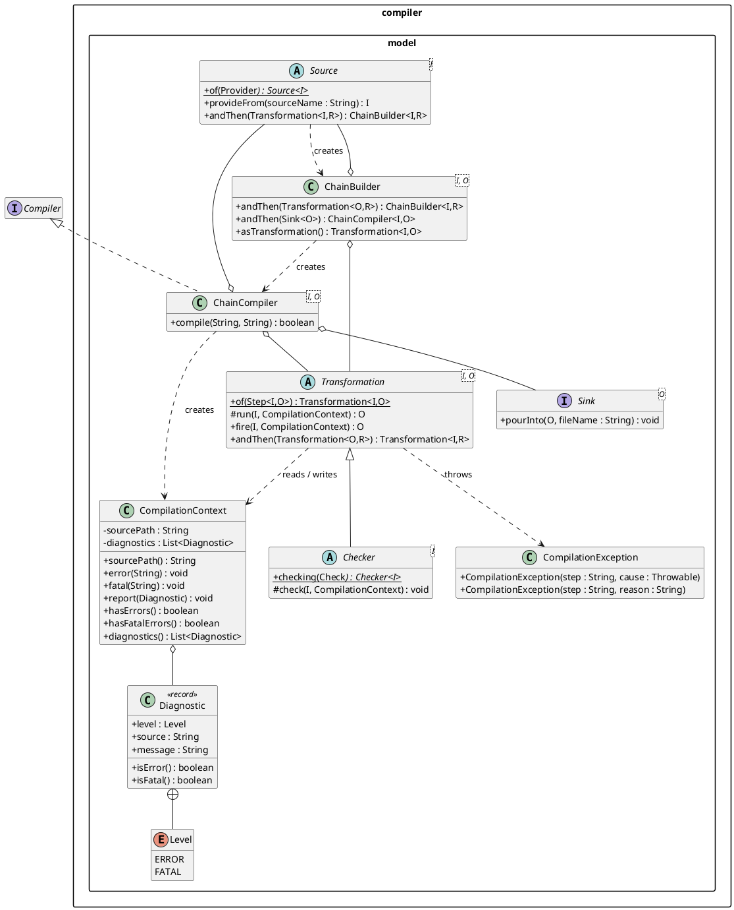
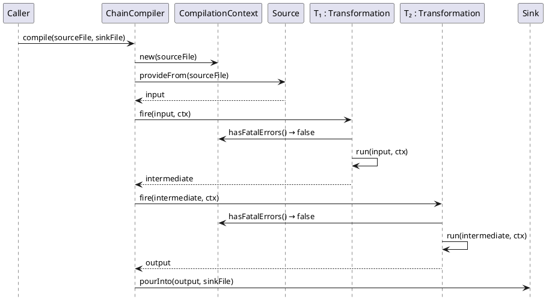

# Compiler

The `jpipe-compiler` module transforms a `.jd` source file into an output
artefact through a typed, composable pipeline. It is structured around two
packages.

## Packages

### `compiler`

The top-level package exposes a single public contract and its two concrete
implementations.

`Compiler` is a two-method interface: `compile(sourceFile, sinkFile)`. It is
the only type that callers outside the module need to reference.

`ChainCompiler` is the standard implementation, assembled by the fluent DSL in
`compiler.model`. It is not instantiated directly — `ChainBuilder.andThen(Sink)`
produces it as the final step of pipeline construction.

### `compiler.model`

The pipeline abstraction. Every compilation pipeline is built from three roles —
**Source**, **Transformation**, **Sink** — assembled through a fluent
`ChainBuilder` DSL and driven by a `CompilationContext` that is threaded through
every step.

**Roles**

- **`Source<I>`** — first step: reads a file path and produces the initial
  pipeline value of type `I`. Subclasses implement `provideFrom`; lightweight
  sources can be expressed as lambdas via `Source.of(Provider)`.
- **`Transformation<I, O>`** — middle step: a typed function `I → O`. Subclasses
  implement the protected `run` method; callers always go through the final
  `fire` method, which handles logging, null-output detection, fast-fail on
  accumulated fatal errors, and wrapping of checked exceptions into
  `CompilationException`. Lightweight steps can be expressed as lambdas via
  `Transformation.of(Step)`. Steps are composed via `andThen`.
- **`Checker<I>`** — a specialisation of `Transformation<I, I>` whose `run` is
  sealed to always return its input unchanged. Subclasses implement `check`,
  which may report non-fatal diagnostics via the context without throwing.
  Lightweight checkers can be expressed as lambdas via `Checker.checking(Check)`.
- **`Sink<O>`** — last step: serialises the final pipeline value to a file.
  Implemented as an interface so lambda expressions are supported directly.

**Assembly**

`Source.andThen(Transformation)` starts the builder, returning a
`ChainBuilder<I, O>`. Subsequent `andThen(Transformation)` calls extend the
chain, each returning a new immutable `ChainBuilder` with the composed type.
`ChainBuilder.andThen(Sink)` closes the chain and returns a ready-to-use
`ChainCompiler`. `ChainBuilder.asTransformation()` exposes the accumulated chain
as a plain `Transformation`, allowing sub-pipelines to be embedded inside
larger ones.

**Context**

`ChainCompiler.compile` creates one `CompilationContext` per call and threads
it through every `fire` and `run` invocation. The context carries the source
file path and a `Diagnostic` bag. Steps report issues via `ctx.error()` or
`ctx.fatal()`; `fire` fast-fails before running a step if the context already
holds a fatal diagnostic. `Diagnostic` is a record with two severity levels:
`ERROR` and `FATAL`. `compile` returns `true` when at least one `ERROR` or
`FATAL` was reported (see ADR-0016).

The sequence below shows a single `compile` call flowing through a three-step
pipeline.

