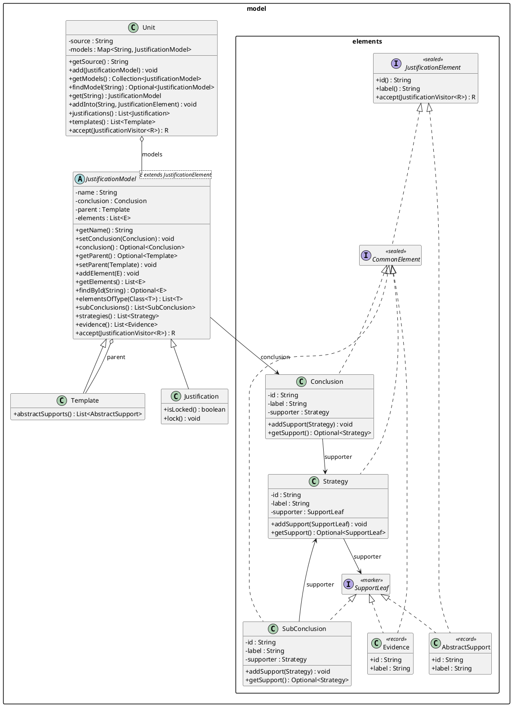
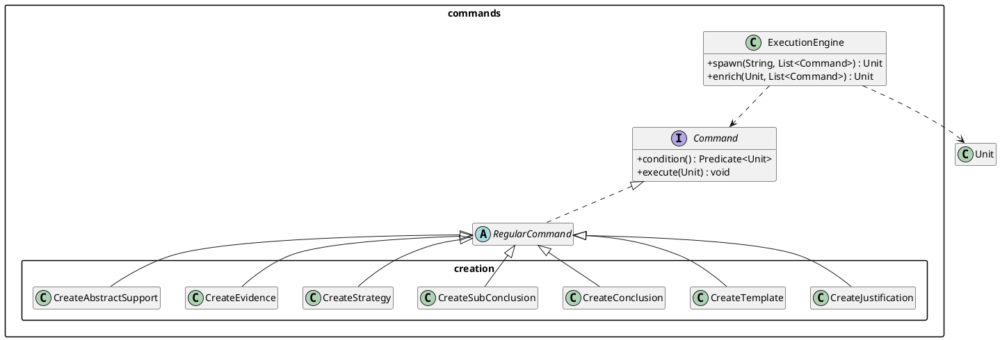
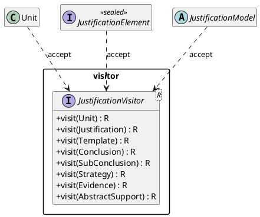

# Model

The `jpipe-model` module defines the internal representation of a compiled jPipe
file. It is structured around four packages.

## Packages

### `model.elements` and `model`

The element hierarchy is rooted at the sealed interface `JustificationElement`.
Elements that appear in both justifications and templates implement `CommonElement`;
`AbstractSupport` is template-only.

Support relationships are encoded directly via typed fields and one marker interface:

- **`SupportLeaf`** — marker for elements that can act as direct supporters
  (`SubConclusion`, `Evidence`, `AbstractSupport`).
- `Conclusion` and `SubConclusion` each hold a single `supporter : Strategy`; `Strategy`
  holds a single `supporter : SupportLeaf`. Cardinality is enforced at assignment time.

`JustificationModel<E>` is the sealed base for `Justification` (accepts only
`CommonElement`) and `Template` (accepts any `JustificationElement`). A `Unit`
is the root produced by compiling one `.jd` file.

### `commands` / `commands.creation`

Model construction uses the Command pattern. `RegularCommand` is the base for all
concrete commands. The `ExecutionEngine` handles deferred execution (commands whose
condition is not yet met) and deadlock detection.

### `visitor`

`JustificationVisitor<R>` provides a typed traversal over the full element
hierarchy. All model nodes implement `accept`.

