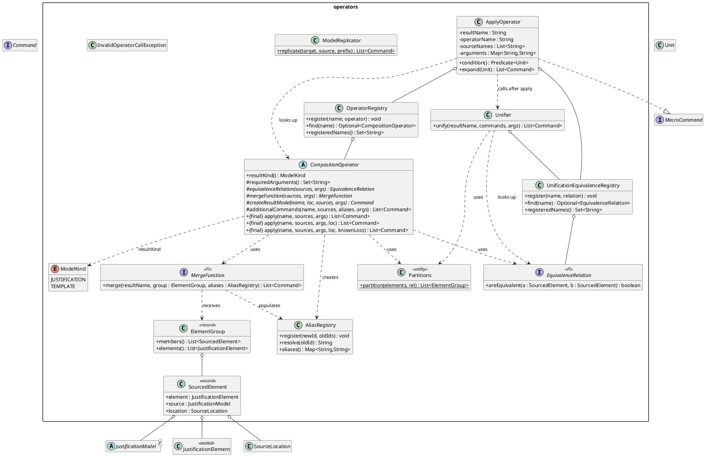
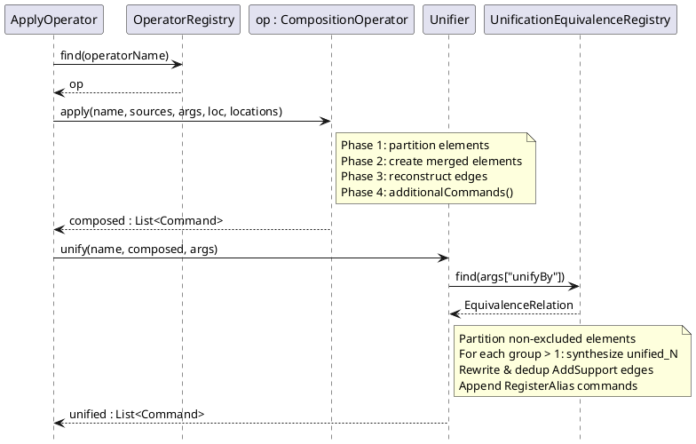
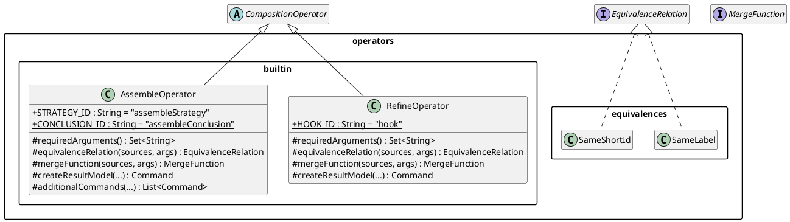

# Operators

The `jpipe-operators` module implements composition operators — the mechanism
by which new justification models are assembled from existing ones. It is
structured around three packages.

## Packages

### `operators`

The core framework. A **composition operator** transforms a list of source
`JustificationModel`s into a command list that, when executed, builds the
result model. All operators extend the abstract `CompositionOperator` and
must only implement three hooks; the sealed `apply()` template method owns
the full four-phase algorithm.

**Phases of `apply()`**

1. **Partition** — collects all elements from every source model into
   `SourcedElement` records, then partitions them into equivalence classes
   using the operator's `equivalenceRelation`. Uses the shared `Partitions`
   utility.
2. **Create** — calls the operator's `mergeFunction` for each group. Each
   call produces `Create*` commands and must register merged ids in the
   supplied `AliasRegistry`.
3. **Link** — reconstructs support edges by translating original endpoints
   through `AliasRegistry.resolve()`, with set-based deduplication.
   `RegisterAlias` commands are also emitted here to persist the alias map
   in the `Unit`.
4. **Additional** — calls the optional `additionalCommands` hook, which
   operators override to inject synthesized elements and edges that have no
   counterpart in any source (e.g. the aggregating strategy in `assemble`).

**Phase 4 — automatic unification** is applied by `ApplyOperator.expand()`
*after* `apply()` returns, via `Unifier.unify()`. It is not part of the
sealed template. See the *Unifier* subsection below.

**Supporting types**

- **`SourcedElement`** — a record pairing a `JustificationElement` with its
  origin `JustificationModel` and `SourceLocation`. Used in Phases 1–2.
- **`ElementGroup`** — a partition member: an immutable list of
  `SourcedElement`s that belong to the same equivalence class.
- **`AliasRegistry`** — a `LinkedHashMap<String, String>` from old element
  id to new id. `resolve(id)` returns `id` unchanged when no alias is
  registered, making Phase 3 edge rewriting safe for singleton groups.
- **`Partitions`** — package-private utility; the O(n²) representative-based
  partition algorithm shared by `CompositionOperator` and `Unifier`.
- **`OperatorRegistry`** — a name-to-`CompositionOperator` map. Populated at
  compiler startup in `CompilerFactory.builtInOperators()`; looked up by
  `ApplyOperator` at model-build time.
- **`ModelKind`** — two-value enum (`JUSTIFICATION`, `TEMPLATE`).
  `ApplyOperator` validates that the operator's `resultKind()` matches the
  kind declared in the source file.
- **`InvalidOperatorCallException`** — unchecked exception thrown for unknown
  operators, missing required arguments, incompatible kinds, or unknown
  unification methods. The engine wraps it in `CompilationException`.
- **`ModelReplicator`** — stateless utility that generates commands to copy a
  model's elements and edges under a given id prefix. Used to clone source
  content non-destructively.

**`ApplyOperator`**

`ApplyOperator` implements `MacroCommand` (from `jpipe-model`). It is emitted
by `ActionListProvider` whenever a justification or template declaration
carries an operator call in the source file. The engine defers its execution
until all named source models are present in the `Unit`.

- `condition()` — defers until `unit.findModel(name)` succeeds for every
  source name.
- `expand(Unit)` — looks up the operator, validates `resultKind`, gathers
  source models, calls `op.apply(…)`, then passes the result through
  `Unifier.unify()` before returning the final command list.

**`Unifier`**

Post-processor invoked by `ApplyOperator.expand()` after `op.apply()`.
Merges result-model elements that belong to the same equivalence class into
a single synthesized element whose id is `"unified_N"` (N = 0-based counter
per merged group). All original ids are aliased to the new id. `AddSupport`
commands referencing removed ids are rewritten and deduplicated.

Controlled by two optional operator config parameters:

| Parameter | Default | Meaning |
|-----------|---------|---------|
| `unifyBy` | `"sameLabel"` | Name of the equivalence relation to use |
| `unifyExclude` | *(empty)* | Comma-separated result-model element ids to exclude from unification |

`UnificationEquivalenceRegistry` maps names to `EquivalenceRelation`
instances. It is populated at compiler startup in
`CompilerFactory.builtInUnificationEquivalences()`. `SameShortId` is
intentionally absent — it is reserved for Phase 1 operator equivalence only.



The sequence below shows `ApplyOperator.expand()` processing one operator
call and the post-composition unification pass.



### `operators.equivalences`

Named implementations of `EquivalenceRelation` used in Phase 1 (operator
partitioning). Both are also available for use in `UnificationEquivalenceRegistry`
except where noted.

- **`SameLabel`** — two elements are equivalent iff they share the same label
  string. Registered as `"sameLabel"` in `UnificationEquivalenceRegistry`.
- **`SameShortId`** — two elements are equivalent iff the suffix after the
  last `:` in their ids matches (e.g. `a:s` ≡ `b:s`). Used as the Phase 1
  equivalence relation in `CompositionOperatorTest.TestOperator`. **Not**
  registered for unification.

### `operators.builtin`

Built-in operator implementations. Each is registered in
`CompilerFactory.builtInOperators()` and receives a short name used in
`.jd` source files.

**`RefineOperator`** (`"refine"`)

Syntax: `justification R is refine(base, refinement) { hook: "base/elementId" }`

Merges one element from `base` (the *hook*) with the conclusion of
`refinement` into a single `SubConclusion` whose id is `"hook"`. All other
elements are copied with `sourceName:elementId` qualified ids. Requires the
`hook` argument in `"modelName/elementId"` form.

**`AssembleOperator`** (`"assemble"`)

Syntax: `justification A is assemble(s₁, …, sₙ) { conclusionLabel: "…" strategyLabel: "…" }`

Demotes each source's `Conclusion` to a `SubConclusion`, wires all demoted
sub-conclusions through a synthesized aggregating `Strategy` (id:
`"assembleStrategy"`), and tops them with a synthesized `Conclusion` (id:
`"assembleConclusion"`). All other elements are copied with source-prefixed
ids. Result is a `Template` if any source is a `Template`.

## Extension Points

### Adding a new equivalence relation

An equivalence relation is used in two independent contexts:

- **Phase 1 (operator partitioning)** — determines which source elements are
  merged during `CompositionOperator.apply()`.
- **Phase 4 (post-composition unification)** — determines which result-model
  elements are merged by `Unifier.unify()`.

Whether a new relation is available in one or both contexts depends on where
it is registered.

**Step 1 — implement `EquivalenceRelation`**

Create a class in `operators.equivalences` (or `operators.builtin` if it is
operator-specific):

```java
package ca.mcscert.jpipe.operators.equivalences;

import ca.mcscert.jpipe.operators.EquivalenceRelation;
import ca.mcscert.jpipe.operators.SourcedElement;

public final class SimilarLabel implements EquivalenceRelation {

    private final int maxDistance;

    public SimilarLabel(int maxDistance) {
        this.maxDistance = maxDistance;
    }

    @Override
    public boolean areEquivalent(SourcedElement a, SourcedElement b) {
        return levenshtein(a.element().label(), b.element().label()) <= maxDistance;
    }

    private static int levenshtein(String a, String b) { /* … */ }
}
```

**Step 2 — register for unification**

Open `CompilerFactory.builtInUnificationEquivalences()` and add:

```java
registry.register("similarLabel", new SimilarLabel(2));
```

The string key (`"similarLabel"`) is the value users write in `unifyBy`.
**Do not** register it in `OperatorRegistry` — that is for composition
operators only.

**Step 3 — register for Phase 1 (optional)**

If the relation should also be usable as a Phase 1 equivalence inside a
custom operator, simply pass it from that operator's `equivalenceRelation()`
hook. No global registry is needed for Phase 1.

**Step 4 — test**

Add unit tests in `UnifierTest` (for unification) and / or
`CompositionOperatorTest` (for Phase 1 use), then add a Cucumber scenario
in `operators.feature` that exercises the new key end-to-end.

---

### Adding a new composition operator

A composition operator transforms a list of source `JustificationModel`s into
a flat command list. Extending `CompositionOperator` requires implementing
exactly three abstract hooks; the four-phase algorithm is owned by the sealed
`apply()` method and must not be overridden.

**Step 1 — extend `CompositionOperator`**

Create a class in `operators.builtin`:

```java
package ca.mcscert.jpipe.operators.builtin;

import ca.mcscert.jpipe.operators.*;

public final class MyOperator extends CompositionOperator {

    // (1) Declare the result kind — JUSTIFICATION or TEMPLATE
    @Override
    public ModelKind resultKind() { return ModelKind.JUSTIFICATION; }

    // (2) Required argument names (empty if none)
    @Override
    protected Set<String> requiredArguments() { return Set.of("myParam"); }

    // (3) How source elements are partitioned into equivalence classes
    @Override
    protected EquivalenceRelation equivalenceRelation(
            List<JustificationModel<?>> sources,
            Map<String, String> args) {
        return new SameShortId();   // Phase 1 only — not registered for unification
    }

    // (4) How each equivalence class is merged into a new element
    @Override
    protected MergeFunction mergeFunction(
            List<JustificationModel<?>> sources,
            Map<String, String> args) {
        return (resultName, group, aliases) -> {
            // Build Create* commands; call aliases.register(newId, oldIds)
            // ...
        };
    }

    // (5) The command that creates the result model itself
    @Override
    protected Command createResultModel(String name, SourceLocation loc,
            List<JustificationModel<?>> sources,
            Map<String, String> args) {
        return new CreateJustification(name, loc);
    }

    // (6) Optional: synthesize elements/edges with no counterpart in any source
    @Override
    protected List<Command> additionalCommands(String name,
            List<JustificationModel<?>> sources,
            AliasRegistry aliases,
            Map<String, String> args) {
        return List.of(/* synthesized Create* and AddSupport commands */);
    }
}
```

`additionalCommands` defaults to returning an empty list, so override it only
when the operator must inject elements that did not exist in any source.

**Step 2 — register the operator**

Open `CompilerFactory.builtInOperators()` and add:

```java
operators.register("myOp", new MyOperator());
```

The string key (`"myOp"`) is the name users write in `.jd` source files.

**Step 3 — document the syntax**

Operators are invoked with the syntax:

```
justification R is myOp(source1, source2) { myParam: "value" }
```

Document the required and optional arguments and the structural contract of
the result model in a Javadoc comment on the class.

**Step 4 — test**

Add a Cucumber end-to-end scenario in `operators.feature` and at least one
`.jd` fixture in `examples/` that exercises the new operator. Verify edge
cases such as missing required arguments (use the `invalid/` fixture
directory) and unexpected model kinds.


