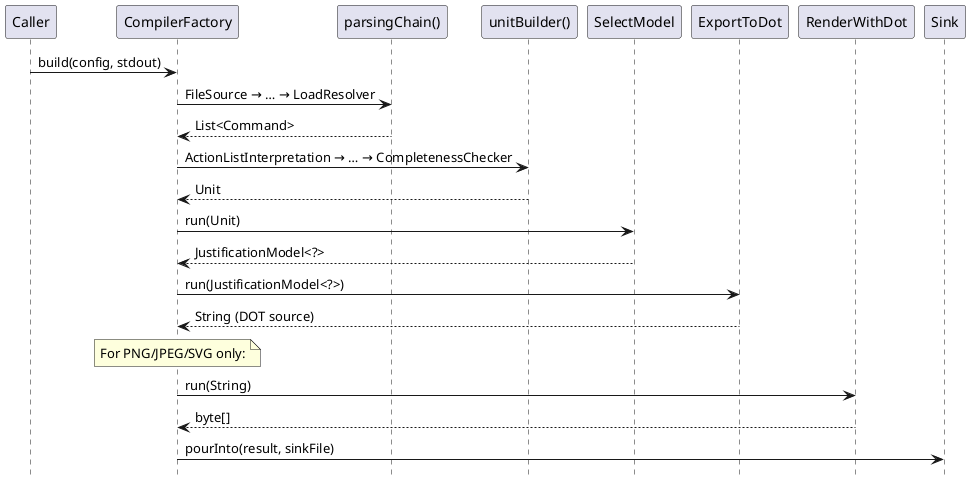

# Compiler Steps

The `jpipe-compiler` module wires concrete pipeline steps into the
`Source / Transformation / Checker / Sink` framework described in
[compiler.md](compiler.md). This document describes every step class and the
two reusable sub-chains that `CompilerFactory` assembles from them.

## Sub-chains

`CompilerFactory` exposes two reusable sub-chains. Every concrete pipeline is
built by composing these two chains with a format-specific export tail.

### `parsingChain()` — source file → `List<Command>`

```
FileSource
  → CharStreamProvider
  → Lexer
  → Parser
  → HaltAndCatchFire<ParseTree>
  → ActionListProvider
  → LoadResolver
```

Reads a `.jd` source file, tokenises and parses it, detects syntax errors,
walks the parse tree to produce a flat list of model-construction commands, and
resolves any `load` directives by recursively parsing referenced files.

### `unitBuilder()` — `List<Command>` → `Unit`

```
ActionListInterpretation
  → ConsistencyChecker
  → CompletenessChecker
```

Executes the command list through the `ExecutionEngine` to build the fully
populated `Unit`, then validates it for consistency and completeness.

### Complete pipeline sequence

The sequence below shows a full `compile` call for DOT output.



---

## Step reference

### Sources

#### `FileSource`

**Type:** `Source<InputStream>`  
**Package:** `compiler.steps.io.sources`

Opens the source `.jd` file path supplied to `compile()` as a raw
`InputStream`. This is always the first step in any pipeline.

---

### Parsing steps

#### `CharStreamProvider`

**Type:** `Transformation<InputStream, CharStream>`  
**Package:** `compiler.steps.transformations`

Wraps the raw `InputStream` in an ANTLR `CharStream` (UTF-8). Required before
ANTLR lexing can proceed.

#### `Lexer`

**Type:** `Transformation<CharStream, CommonTokenStream>`  
**Package:** `compiler.steps.transformations`

Runs the ANTLR-generated `JPipeLexer` over the character stream and produces a
`CommonTokenStream`. Lexer errors are recorded as non-fatal `ERROR` diagnostics
so that parsing can still run and collect further errors.

#### `Parser`

**Type:** `Transformation<CommonTokenStream, ParseTree>`  
**Package:** `compiler.steps.transformations`

Runs the ANTLR-generated `JPipeParser` and returns the root `ParseTree`. Parser
errors are also recorded as non-fatal `ERROR` diagnostics.

#### `HaltAndCatchFire<T>`

**Type:** `Checker<T>`  
**Package:** `compiler.steps.checkers`

A checkpoint that promotes all accumulated non-fatal `ERROR`s to a single
`FATAL` diagnostic. Because `Transformation.fire()` skips `run()` when the
context holds a fatal error, any step placed after `HaltAndCatchFire` is
guaranteed never to receive a broken input. Used after `Parser` to abort before
the tree-walking steps attempt to work on a malformed parse tree.

The name refers to the HCF instruction on IBM System/360 (and a good TV show).

#### `ActionListProvider`

**Type:** `Transformation<ParseTree, List<Command>>`  
**Package:** `compiler.steps.transformations`

Walks the `ParseTree` using an internal ANTLR `JPipeBaseListener` and emits one
`Command` per grammar construct:

- `CreateJustification` / `CreateTemplate` for model declarations
- `CreateConclusion`, `CreateEvidence`, `CreateStrategy`, `CreateSubConclusion`,
  `CreateAbstractSupport` for element declarations
- `AddSupport`, `ImplementsTemplate`, `OverrideAbstractSupport` for
  relationships and template specialisation
- `ApplyOperator` (a `MacroCommand`) for `is refine(…)` / `is assemble(…)`
  operator calls
- `LoadResolver.LoadDirective` (an internal sentinel) for `load` directives

All string labels are unquoted at this stage. Duplicate `conclusion`
declarations within one model are caught here and reported as `ERROR`
diagnostics.

#### `LoadResolver`

**Type:** `Transformation<List<Command>, List<Command>>`  
**Package:** `compiler.steps.transformations`

Eliminates every `LoadDirective` by recursively parsing the referenced file
and splicing its prefixed commands in place. Each referenced file is parsed
through the chain `CharStreamProvider → Lexer → Parser → HaltAndCatchFire →
ActionListProvider` using a fresh `CompilationContext`; diagnostics from the
sub-file are forwarded to the parent context. Cycles are detected by tracking
resolved absolute paths in a `Set<Path>` threaded through the recursion.

When `load "path" as ns` carries a namespace alias, every model-name reference
in the expanded sub-list is qualified with `ns:` so that loaded models do not
collide with locally declared ones.

---

### Model-building steps

#### `ActionListInterpretation`

**Type:** `Transformation<List<Command>, Unit>`  
**Package:** `compiler.steps.transformations`

Feeds the flat command list to the `ExecutionEngine`, which handles deferred
execution and macro expansion (see `model.md` — Commands). The result is a
fully populated `Unit`.

If execution deadlocks (deferred commands that can never run because their
conditions remain unsatisfied), `ExecutionFailureDiagnostics` maps each stuck
command to a specific semantic `ERROR` (e.g. `[unknown-element]`) rather than
propagating a raw exception. The partial `Unit` built so far is returned so
that downstream diagnostic steps can still run.

#### `ConsistencyChecker`

**Type:** `Checker<Unit>`  
**Package:** `compiler.steps.checkers`

Delegates to `ConsistencyValidator` (from `jpipe-model`) and maps each
structural violation to a non-fatal `ERROR` diagnostic, enriched with source
location from the unit's location registry. Consistency rules check for things
like unresolved support references and type mismatches.

#### `CompletenessChecker`

**Type:** `Checker<Unit>`  
**Package:** `compiler.steps.checkers`

Delegates to `CompletenessValidator` (from `jpipe-model`) and reports
violations as non-fatal `ERROR`s. Completeness rules verify that each
`Justification` has exactly one `Conclusion` and that every declared support
edge is reachable.

---

### Selection and export steps

#### `SelectModel`

**Type:** `Transformation<Unit, JustificationModel<?>>`  
**Package:** `compiler.steps.transformations`

Extracts one `JustificationModel` from the `Unit` by name (from the `-d` /
`--diagram` CLI flag). When no name is given and the unit contains exactly one
model, that model is auto-selected. If the unit contains multiple models and no
name is given, a `CompilationException` is thrown listing the available names.

#### `ExportToDot`

**Type:** `Transformation<JustificationModel<?>, String>`  
**Package:** `compiler.steps.transformations`

Serializes a model to a Graphviz DOT string using `DotExporter` (a
`JustificationVisitor` from `jpipe-model`). The color palette is
colorblind-safe (see ADR-0014).

#### `ExportToJson`

**Type:** `Transformation<JustificationModel<?>, String>`  
**Package:** `compiler.steps.transformations`

Serializes a model to a JSON string using `JsonExporter`.

#### `ExportToJpipe`

**Type:** `Transformation<JustificationModel<?>, String>`  
**Package:** `compiler.steps.transformations`

Serializes a model back to canonical jPipe source syntax using `JpipeExporter`.
Useful for normalisation or round-trip testing.

#### `ExportToPython`

**Type:** `Transformation<JustificationModel<?>, String>`  
**Package:** `compiler.steps.transformations`

Serializes a model as a Python object model using `PythonExporter`.

#### `RenderWithDot`

**Type:** `Transformation<String, byte[]>`  
**Package:** `compiler.steps.transformations`

Shells out to the `dot` command-line tool (Graphviz) to render DOT source to a
binary image. The `dot` binary must be on `PATH`; `jpipe --doctor` checks for
it. DOT source is written to `stdin` in a virtual thread while `stdout` is read
in the caller thread, avoiding deadlock when the process pipe buffer is smaller
than the input. Supports any format that `dot -T` accepts; the CLI uses
`"png"`, `"jpeg"`, and `"svg"`.

#### `DiagnosticReport`

**Type:** `Transformation<Unit, String>`  
**Package:** `compiler.steps.transformations`

Produces a human-readable diagnostic report from the compiled `Unit` and
`CompilationContext`. Used by the `diagnostic` CLI command instead of an
export. The report has four sections: Diagnostics, Action Statistics, Model
Summary (type, parent, element counts per model), and Symbol Table (element
ids with source locations and alias mappings from composition operators).

---

### Sinks

#### `StringSink`

**Type:** `Sink<String>`  
**Package:** `compiler.steps.io.sinks`

Writes a `String` result to an `OutputStream` (typically `stdout`). Used by
all text-format pipelines.

#### `ByteSink`

**Type:** `Sink<byte[]>`  
**Package:** `compiler.steps.io.sinks`

Writes a `byte[]` result to an `OutputStream`. Used by image-format pipelines
(`RenderWithDot` output).
